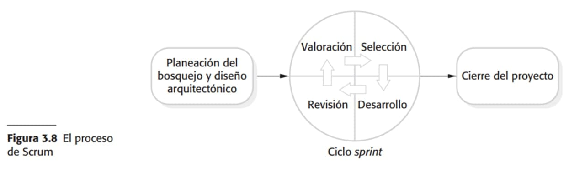

# INGENIERÍA DE SOFTWARE

*Guía elaborada por Ximena Toledo Rivera*

# CAPÍTULO 1

## ¿Qué es el software?

>  Programas de computadoras y su documentación asociada.

## Carcaterísticas del software
* Funcional
* Mantenible
* Confiable
* Usable

## Ingeniería de software
> Disciplina de la ingeniería que se interesa por todos los aspectos que conforman producción de software.
* Es el sentido práctico del desarrollo y distribución del software.
* El reto que enfrenta --> La demanda de distribución limitados  y desarrollo confiable de software.

## Actividades fundamentales
+ Especifícación del software
+ Desarrollo del software
+ Validación del software
+ Evolución del software

## Diferencias
Ciencias de la Computación | Ingeniería en sistemas |Ingeniería de software |
--------------------------|------------------------|------------------------
|Se enfoca en la teoría y fundamentos de la computación.|Se enfoca  en todos los aspectos relacionados con las computadores(software,hardware e ingeniería de procesos)|Se enfoca en es aspecto pŕactico de desarrollar y entregar buen software|
## Tipos de productos de software
* Genéricos
    + Sistemas diseñados para un mercado específico y comprados por cualquier persona u organización.
    * Ejemplos
        + Microsoft Office
        + Windows 
        + MacOs
* Personalizados
    + Software hecho para un cliente en particular que resuelva un problema en específico, desiciones tomadas por el cliente.
    * Ejemplo
        + Sistemas de control de dispositivos electrónicos
        + Sistemas críticos para apoyar un proceso empresarial
        + Sistemas de control de tráfico aéreo

## Un buen software tiene...
* Mantenibilidad -> Evoluciona con los cambios.
* Fiabilidad y seguridad -> Sin causar daño físico y económico, el sistema no debe corromperse.
* Eficiencia -> No debe desperdiciar recursos (Experiencia del usuario, tiempo de procesamiento, tiempo de respuesta, utilización de memoria,etc.).
* Aceptabilidad -> El usuario debe entenderlo, saber usarlo intuitivamente y debe presentar compatibilidad con sistemas preestablecidos.

> Se requiere producir económicamente y rápidamente sistemas confiables.

## Ciclo de vida del software
* Especifícación ->  Definir el producto
* Desarrollo ->  Diseño y programación
* Validación ->  Cumplimiento de requerimientos del cliente
* Evolución -> Modificaciones según los cambios  reflejados del cliente o del mercado.

## Problemas que afectan a muy diversos tipos de software
* Heterogeneidad
* Cambio empresarial y social
* Seguridad y confianza

## Ética de la ingeniería de software
* Confidencialidad -> Mantener secretos exista o no un acuerdo de confidencialidad.
* Competencia -> No aceptar trabajo que no puedan realizar.
* Propiedad Intelectual -> Mantener al tanto con las patentes y  copyright.
* No abusar sus habilidades técnicas para abusar los sistemas ce cómputo de los clientes o compañias.

## Tipos de aplicaciones

* Independientes
* Interactivas basadas en la transacción
* Sistemas de control embebido
* Sistemas de procesamiento en lotes -> Generalmente usados en conjución con sistemas basados en la web
* Sistemas de entretenimiento
* Sistemas para modelado y simulación
* Sistemas de adquisición de datos
* Sistemas de sistemas

## ACM/IEEE código de ética

> *los ingenieros de software deben comprometerse a hacer el análisis, especificación, diseño, desarrollo, la prueba y mantenimiento del software, una profesión benéfica y respetada...*

* Público - Actuar con interés público
* Cliente y empleador - 
* Producto - Garantizar que los productos y modificaciones satisfagan los estándares profesionales más altos posibles. 
* Juicio - Mantener integridad e independencia en su juicio profesional.
* Gestión - Los líderes deben promover un acercamiento ético a la gestión y desarrollo del software.
* Profesión - Fomentar integridad y la reputación de la profesión.
* Colegas - Ser justos y apoyar a sus colegas.
* Uno mismo - Intervienen en el aprendizaje y promover en un enfoque ético.

## Tipos de sistemas que usan estudios de caso
* Sistema embebido
* Sistema de información
* Sistema de adquisición de datos basados en sensores

## FIN DEL CAPÍTULO 1 
___

# CAPÍTULO 2

## Procesos del software
> Serie de actividades relacionadas que conduce a ña elaboración de un proceso de software.
* Especifícación - Define  lo que el sistema debe hacer.
* Diseño e implementación - Organización e implementación del sistema.
* Validación - Verifica que el sistema hace lo que el cliente necesita.
* Evolución - habilidad de poder actualizar el sistema en respuesta a las necesidades del cliente.
> Representación abstracta de un proceso real.
##  Descripciones de procesos de software
* Productos - Resultados de una actividad de proceso
* Roles - Responsabilidades de las personas que intervienen en el proceso.
* Pre y post condiciones - Declaraciones válidas antes y después de que se realice una actividad del proceso o se cree un producto.
## Tipos de procesos
* Plan-driven
    + Todas las actividades del proceso se planean por anticipado y el avance se mide contra dicho plan.
* Ágil
    + La planeación es incremental y es más fácil modificar el proceso para reflejar los requerimientos cambiantes del cliente.

> En la práctica se combinan los procesos.

# Modelos de proceso de software
> Abstracciones del proceso

> Los paradigmas del proceso son modelos de proceso generales con una perspectiva arquitectónica.

## WATERFALL
> Modelo plan-driven, las fases de especifícación y desarrollo se encuentran separadas.

### PROCESOS

* Definición de requerimientos
* Diseño de software y sistemas
* Implementación y testing
* Integración y system testing
* Operación y mantenimiento

### DESVENTAJA

* Dificultad  de adaptar el cambio despues de que el proceso ha sido implementado.
* La siguiente fase no se debe comenzar sino hasta que termine la fase previa.

## DESARROLLO INCREMENTAL
> Funciona con modelo plan-driven o agile. mezcla las fases de especificación, desarrollo y validación.

### PROCESOS
* Especifícación - Versión inicial
* Desarrollo - Versions intermedias
* Validación -  versión final

### VENTAJAS

* El costo de acomodar los cambios de los requeistos del cliente es reducido.
* La cantidad de análisis y documentación reescrita es mucho menor que la del modelo WATERFALL.
* Es más sencillo obtener retroalimentación del cliente acerca del desarrollo completado.
* El cliente puede evaluar el desarrollo del sistema en una etapa temprana.
* Entrega de software rápida.

### DESVENTAJA
* EL proceso no es realmente visible porque se encuentra encapsulado dentro de las actividades concurrentes.
* Los administradores del proyecto necesitan entregas regulares para determinar el progreso.
* La estructura del sistema tiende a degradarse conforme se tienen nuevos incrementos.
    + Los cambios regulares tienden a correomper la estructura del sistema.
> solución = invertir tiempo y dinero en  refactorixar el software.

## INTEGRACIÓN Y CONFIGURACIÓN
> El sistema es ensamblado usando componentes previamente  desarrollados,Funciona con modelo plan-driven o agile.

* Integra componentes existentes o COST (*Commercial off-the-shelf*)
* Configurarse para adaptar los comportamientos y funcionalidad para los requisitos de un usuario.

### PROCESOS
* Análisis de componentes
* Modificación de requerimientos
* Diseño de sistema con reutilización
* Desarrollo e integración

### VENTAJAS

* Reducir la cantidad de software a desarrollar.
* Disminuir costos y riesgos.
* Entrega más rápida de software.
### DESVENTAJAS
* Inevitables compromisos de los usuarios y esto condice hacia un sistema que no subra las necesidades reales de los usuarios.
* Pierde algo de control sobre la evolución del sistema.

## Modelo en espiral (Boehm)
> Proceso de software dirigido por el riesgo.
Combina el evitar el cambio con tolerancia al cambio.

> Parte de la base de que el desarrollo de aplicaciones se debe llevar a cabo en un ciclo iterativo que se deba repetir tantas veces cmo sea necesario hasta alcanzar un objetivo. Gracias a las valoraciones regulares de los riesgos y a los controles rutinarios del producto intermedio, el modelo minimiza considerablemente el riesgo de fracaso en los proyectos de software.

### PROCESOS
* Repetición ciclica

1. Establecimiento de objetivos (descripción de de la condiciones generales)
2. Valoración y reducción del riesgo
3. Desarrollo y validación (Creación de prototipos)
4. Planeación (Si será necesario tomar otro ciclo)
### VENTAJAS
* Minimiza de forma decisiva el riesgo de fracaso del proceso de desarrollo gracias a los *controles regulares*
* La valoración periódica de los riesgos cuando se aplican a entornos técnicos modernos
* Siempre es posible obtener y tener en cuenta el feedback

### DESVENTAJAS
* Gran esfuerzo de gestión
* Decisiones periódicas pueden dilatar el proceso de desarrollo
* Hay errores e incongruencias conceptuales
* Know-how en análisis y gestión de riesgo esencial.
* No apropiado para pequeños proyectos.
## Proceso Unificado racional (RUP)

> Forma disciplina de asignar tareas y responsabilidades en una empresa de desarrollo (quién hace qué, cuándo y cómo)
* Se enfoca en la arquitectura del software

### FASE DEL CICLO DE VIDA
* Iniciciación /Incepción
* Elaboración
* Desarrollo 
* Transición
### FLUJOS DE TRABAJO
1. Modelado de negocio
2. Requerimientos
3. Análisis y diseño
4. Implementación
5. Pruebas
6. Despliegue
7. Gestión y configuración de cambios
8. Gestión del proyecto
9. Entorno
### VENTAJAS
* Mantenimiento sencillo y modificaciones locales.
* Reutilización.
* Ofrece a cada usuario , un filtrado personalizado de la definición del proceso aplicado, acorde con su rol dentro del proyecto.

### DESVENTAJAS
* Alto grado de complejidad.
* Método pesado.
* En proyectos pequeños, es posible que no se puedan cubrir los costos de dedicación del equipo de profesionales necesarios.

## Modelo V
>
### PROCESOS

1. Análisis de requerimientos
2. Diseño del sistema
3. Diseño detallado
4. Implementación de programas y prueba unitaria
5. Prueba de integración
6. Prueba del sistema
7. Prueba de aceptación
8. Operación y mantenimiento

### VENTAJAS
*  Hace explícito parte de la iteración y trabajo.
* Especifica los roles de los distintos tipos de pruebas a realizar.
* Involucra al usuario en las pruebas.
### DESVENTAJAS
* Díficil que el cliente exponga explicítamente todos los requisitos.
* La pruebas pueden ser no tan efectivas
* EL producto final no reflejará todos los requisitos del usuario.

## Actividades del proceso

> Secuencias intercaladas de actividades técnicas, colaborativas y administrativas para especificar, diseñar y determinar la calidad de un sistema de software.
* Específicación
* Desarrollo 
* Validación
* Evolución
> Waterfall - Secuencias

> Desarrollo incremental - Entrelazados

# PROCESO INGENIERÍA DE REQUERIMIENTOS
> 

## Actividades principales del proceso

* Estudio de factibilidad - Estimación sobre las necesidades
* Obtención y análisis de requerimientos - Derivar los requerimientos del sistema mediante la observación.
* Especificación de requerimientos - Actividad de transcribir la información recopilada durante la actividad de análisis en un documento que define un conjunto de requerimientos.
* Validación de requerimientos - Verifica que los requerimientos sean realistas, coherentes y completos (se descubren errores).

## Diseño e implementación de software
* Etapa de implementación -  Proceso de convertir una especificación del sistema en un sistema ejecutable e involucrrar la corrección en la especificación del software.
* Diseño del software - Descripción de la estructura del software que define la implemntación. 

## Modelo abstracto del proceso de diseño
> 

1. Diseño arquitectónico - identificación de estructura global del sistema, principales componentes, relaciones y cómo se distribuyen.
2. Diseño de interfaz - interfaz sin ambigüedades.
3. Diseño de componentes - Se toma cada componente del sistema y se diseña cómo funcionará.
    * Buscan componentes reutilizables
4. Diseño de base de datos - Se diseñan las estructuras del sistema de datos y cómo se presentarán.

## Prubas de defectos y depuración
> Prueba de defectos - establece existencia de defectos

> Depuración - Localiza y corrige los defectos y aquí se elabora una hipótesis.

## Validación de software

> V&V verificación y validación
Creado para mostrar que un sistema cumple tanto con sus especificaciones como con las expectativas del cliente.
> 

## Etapas de proceso

1. Prueba de desarrollo - Probar los componentes independientemente (funciones, objetos o agrupamientos de estas actividades).
2. Pruebas del sistema - Ejecutar el sistema con diferentes casos derivados de la especificación de datos reales que serán procesados por el sistema.
3. Prueba de aceptación - Se realizan con los datos del cliente para verificar que el sistema cumple con las necesidades del cliente

## Probando fases en un proceso de software plan-driven
>
## Evolución del software

> Desarrollo y mantenimiento de sotware de manera continua en lugar de tomar los procesos separados.
>

* SOftware flexible y en constantes cambios.

## Enfoques para reducir costos del rehacer (Refactorization)

* Anticipación al cambio
* Tolerancia al cambio

## Enfrentar los cambios

* Prototipado de sistemas
* Entrega incremental 

## Desarrollo de prototipos
>

* Se enfocan en funcionalidad en lugar de estabilidad y seguridad.
* Deben ser descartados después de un desarrollo.
* Carecen de documentación.
* La estructura es degradada debido al cambio rápido.
* Probablemento no cumplira los estándares de calidad promedio.
### PROCESO

1. Establecimiento de objetivos del prototipo   
    + Plan de creación del prototipo
2. Definición de la funcionalidad del prototipo
    + Bosquejo de definición
3. Desarrollo del prototipo
    + Prototipo ejecutable
4. Evaluación del proceso 
    + Reporte de evaluación

Un prototipo es una versión inicial de un sistema para demostrar conceptos e experimentar diseños.

* Usado en ingeniería de requerimientos para validar los requerimientos.

### BENEFICIO
* Mejorar la usabilidad de un sistema.
* Mejora calidad del diseño.
* Mejorar la mantenibilidad .

## Entrega Incremental
> En lugar de hacer una sola entrega/ unidad el desarrollo es dividido en incrementos donde cada incremento entrega una parte de la funcionalidad requerida.
>

* Da prioridad a los requerimientos del usuario y de alta prioridad.
* Una vez que el desarrollo de un incremento ha iniciado , los requerimientos se congelan.

### PROCESOS
1. Definición de los requerimientos del bosquejo
2. Asignación de requerimientos a incrementos
3. Diseño de arquitectura del sistema
4. Desarrollo de incremento del sistema
5. Validar incremento
6. Integrar incremento
7. Validar sistema
8. Implementar incremento
    * Si no está completo regresa  al paso 4
    * SI está completo --> Sistema final

### DIFERENCIAS
* Desarrollo incremental
    + Desarrrolla el sistema de incrementos y evalua cada incremento antes de proceder con el desarrollo del siguiente incremento (proceso normal en metodología ágiles)
* Entrega incremental
    + Despliega un incremento para que los usuarios finales puedan usar el software.

### VENTAJAS
* Se puede entregar valor a los clientes  con cada incremento de tal manera que las funcionalidades del sistema están disponibles antes de tiempo.
* Reduce el riesgo de una falla en el proyecto.
### DESVENTAJA
* La mayoria d los requeisitos no están definidos a detalle hasta que el siguiente incremento se implemente.
* la esencia de un proceso iterativo es que las especificaciones  se desarrollan en conjunto con el software.
## las mejoras de procesos 
* identificar, análizar y mejorar los procesos del sistema establecidos.
* Entender los procesos existentes
## Implementar mejora de procesos
* Madurez del proceso - Mejora e introduce buenas prácticas de ingeniería de software.
* ágil - Se concentra en desarrollo iterativo y reducción de gastos en los procesos.
## Ciclo de mejora de procesos
>

* Deciden si las mejoras del proceso han sido eficientes.

## Niveles de madurez
>

# CAPÍTULO 3

## Métodos ágiles
> Método de desarrollo incremental donde los incrementos son mínimos y, por lo general se crean las nuevas  liberaciones del sistema.

* Involucra a los clientes en el proceso de desarrollo para conseguir retroalimentación.
* Enfoque que incluye
    + SCRUM
    + Crystal
    + DSDM
* Documento clave --> Documento de requerimientos del sistema.
## ENFOQUE PLAN-DRIVEN Y ÁGILE
* Enfoque ágiles - Diseño e implementación como actividades centrales(iteraciones através de las actividades).
* Enfoque basado en plan - identifica las etapas separadas en el proceso de software con salidas asociadas a cada etapa(la iteración ocurre dentro de las actividades con documentos formales usados para comunicarse entre etapas de proceso).
>
## Programación externa XP
>

* *Spike* es un incremento donde no se realiza la programación, generalmente para diseñar la arquitectura del sistema o desarrollar documentación del sistema.
## Principios de los métodos ágiles
1. Desarrollo incremental
2. Inclusión del cliente
3. Programación en pares
4. Cambio adaptable mediante liberaciones regulares
5. Mantener simplicidad mediante refactorización constante.
## Principios y prácticas
* Planeación incremental
* Liberaciones pequeñas
* Diseño simple
* Desarrollo de la primera prueba
* Refactorización
* Programacipon en pares
* Propiedad colectiva
* Integración contínua
* Ritmo sustentable
* Cliente en sitio
## TARJETAS
1. Histori
2. Tarea
## Pruebas en XP
* Desarrollo de la primera prueba
* Desarrollo de pruebas incrementales a partir de escenarios
* Involucramiento del usuario en el desarrollo y la validación de pruebas
* Uso de marcos de pruebas automatizadas
## Proceso Scrum
> Método ágile, su enfoque está en la administración iterativa del desarrollo, y no en enfoques técnicos específicos para la ingeniería de software agile.
>

* Ciclos  Sprint - Unidad de planeación en la que se valora el trabajo a realizar, longitud física.
* Maestro Scrum - Facilitador que ordena las reuniones

### FASES
1. Planeación del bosquejo
2. Diseño de la arquitectura del software
3. Conclusión del proyecto (Documentación requerida)
    * Marcos de ayuda del sistema.
    * Manuales del usuario.
    * Valora lecciones aprendidas del proyecto.
### Técnicas clave del proceso
* Los sprints tienen longitud fija
* Punto de partida para la planeación es la cartera del producto.
* En la fase de selección incluye a todo el equipo del proyecto
* Organización del equipo
* Se presenta el proyecto a los participantes.

### VENTAJAS
* El producto se desglosa en un conjunto de piezas manejables y comprensibles.
* Los requerimientos inestables no retrasan el proceso.
* Todo el equipo tiene conocimiento de todo.
* Los clientes observan la entrega a tiempo de los incrementos y obtienen retroalimentación del producto.
* Se establece confianza entre los clientes y desarrolladores.

### Escalamiento de métodos agiles
* Los métodos agiles se enfocan en el desarrollo de sistemas pequeños y medianos.
## Prescpectivas de escalamiento
* Scaling up - desarrollo de sistemas grandes
* caling out - Uso de métodos para introducirse en una organización grande con años de experiencia en el desarrollo desoftware.

# CAPITULO 4 